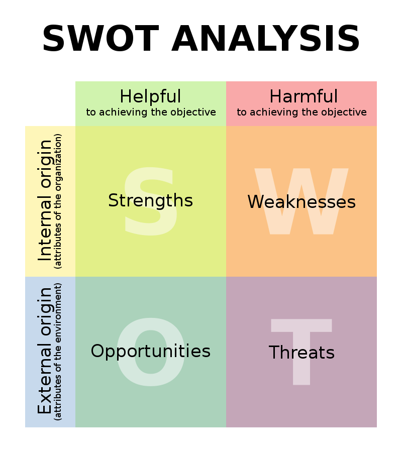

# Podnikání v ČR

## Před začátkem podnikání...

- Nápad: záliba, inspirace existujícím produktem v zahraničí, nespokojenost s produktem nebo službou
- Průzkum - konkurence, statistiky, články
- Finance
- Riziko podnikání

## Podnikatelský záměr

- Produkt
  - podoba
  - průzkum trhu - konkurence, cena, poptávka, diferenciace
- Výrobní faktory
  - lidské zdroje
  - dodavatelé - vstupy
- Finanční plán - podrobný, (konzultovaný)
- **SWOT** analýza
  - **Strengths** | **Weaknesses** | **Opportunities** | **Threats**
  - Analýza vhodná nejen k podnikání
  - Hodně cool a užitečná věc
  - https://en.wikipedia.org/wiki/SWOT_analysis
    

## SWOT analýza liberecké knihovny

### Strengths

    - Kavárna
    - Spousta knih které se dají půjčit
    - Klidné místo na čtení
    - Ticho
    - Inteligentní společnost

### Opportunities

    - Vzdělávání širší společnosti
    - Rozšíření skladu knih
    - Více automatů na kafe

### Weaknesses

    - často nefunkční automat na kafe
    - málo míst na sezení v dolním studovacím patře

### Threats

    - nedostatek zaměstnanců kvůli nižším platům
    - odcizení půjčených knih

## StartUp

- Začínající podniky
- https://lipo.ink - liberecká služba pro začínající podnikatele

## Znaky podnikání

- Soustavnost
- Samostatnost
- Vlastní jméno - činnost vykonávána pod jménem, na které je subjekt zaregistrován
- Vlastní odpovědnost
- Účelem je zisk

## Kdo může podnikat?

### Živnost

- tři kategorie:
  - volná (to co mě reálně zajímá)
  - řemeslná
  - vázaná
- při vytváření živnosti ve volné kategorii je výhodné si v dané kategorii zaškrtat všechno, ikdyž to reálně nevyužiju, lepší než platit další litr

### A) FYZICKÁ OSOBA

- občan
- po získání živnostenského oprávnění zůstává fyzickou osobou
- zároveň se stane osobou samostatně výdělečně činnou (OSVČ)
- zapisují se do živnostenského rejstříku = seznam všech FY
- nabývá platnosti ve chvíli zapsání do živnostenského rejstříku
- https://rzp.cz

### B) PRÁVNICKÁ OSOBA

- tj. firma, společnost, stát...
- zapisují se do obchodního rejstříku
- Oba subjekty musí získat **živnostenské oprávnění**
- osoby, které spolu zakládají PO musí nejprve uzavřít smlouvu o založení, tj. _společenská smlouva_
- oprávnění nabývá platnosti ve chvíli zapsání do obchodního rejstříku = seznam všech PO
- https://or.jutsice.cz

## Právní předpisy podnikání

- Občanský zákoník
  - upravuje vztahy mezi podnikateli a mezi zákazníky a podnikateli
  - Zákon o obchodních korporacích

## Postup vytvoření živnosti

- Žádost o živnostenské oprávnění FO -> zápis do ŽR -> registrace k daním, soc. a zdrav. pojištění (na centrální registračním místě na ŽÚ)
- Odpovědný zástupce
- Pro schválení žádosti musíme splnit:
  - Všeobecné podmínky (plná svéprávnost, bezúhonnost)
  - Zvláštní podmínky (odobrná způsobilost) = vystudování v příslušném oboru, praxe v oboru v případě řemeslné/vázané

### Ohlašovací živnost

- **Volná** - nevyžaduje ani vzdělání ani praxi
- **Řemeslná** - vyžaduje doklad o dosaženém vzdělání v oboru, vzdělání lze nahradit 6ti letou praxí
- **Vázaná** - přísnější než řemeslná, vyžaduje jak praxi, tak vzdělání v oboru

### Koncesované živnosti

- Vyžaduje:
  - Vzdělání
  - Schválení příslušného orgánu státní správy

## Riziko podnikání

- Nezájem na nabízené produkty
- Neprosazení se vůči konkurenci
- Problém v rámci cashflow
- Neplatící odběratelé
- Problém ekonomomického prostředí -> krize

## Obchodní společnosti

- Vzniká uzavřením společenské smlouvy, umístěním sídla, zapsáním podpisového vzoru
- Žádost o živnostenské oprávnění pro právnickou osobu
- Návrh na zapsání společnosti do OR
- Zápisem vzniká obchodní společnost
- Registrace k placení daní, odvádění sociálního a zdravotního pojištění

### Kapitálové

- **s.r.o.** (společnost s ručením omezeným) nebo **a.s.** (akciová společnost)
- pokud jsem dodavatel nebo odběratel jako s.r.o., nikdy nemůžu utratit víc než je majetek firmy
- pokud je majetek jedna koruna ručení společnosti je jedna koruna
- společníci v ní nemusí přímo pracovat
- ručí pouze do výše majetku společnosti - absolutní oddělení osobního a firemního majetky
- společníci mohou přijít pouze o svůj počáteční vklad
- nejvyšším orgánem je **"valná hromada"**
- **tunelování firmy** = odvod majetku firmy do osobního vlastnictví pro vlastní potřeby

#### s.r.o.

- nejrozšířenější typ společnosti (v ČR i ve světě)
- ručení: do výše vkladu
- minimální povinný vklad: 1kč, určeny podíly
- řízení: valná hromada, statutární orgán = **jednatel**
- rozdělení zisku: dle podílů nebo společenské smlouvy
- korunové společnosti
- nevýhody
  - zdanění:
    - příjem právnické osoby 19% + se ještě daní příjem daného zaměstnance
      - dvojí zdanění
  - větší míra administrativních povinností (např. vedení účetnictví)
  - nutnost existence a fungování **valné hromady**

#### a.s.

- minimální povinný vklad: 2 000 000 kč
- tvořena větším množstvím kapitálu - vhodné při založení podnikání s vysokými vstupními náklady
- akcie můžou a nemusí být volně obchodovatelné
- akcie = cenný papír, který dává svému vlastníkovi právo podílet se na řízení, na zisku...
- ručení: za závazky ručí celým svým majetkem (hodnoceným dle hodnoty akcií, o které vlastník přijde)
- pokud má být akcie volně obchodovatelná, minimální vklad je 20mil kč
- řízení: valná hromada, statutární orgán = představenstvo (kontrolováno dozorčí radou) NEBO statutární ředitel (kontrolován správní radou)
- rozdělení zisku: dle počtu a hodnoty akcií

### Osobní

- Všichni (nebo část) společníků ručí celým svým firemním i osobním majetkem
- Společníci ve firmě osobně pracují
- Nejvyšším orgánem jsou všichni společníci (každý z nich)
- v.o.s. - veřejná obchodní společnost
- k.s. - komanditní společnost
