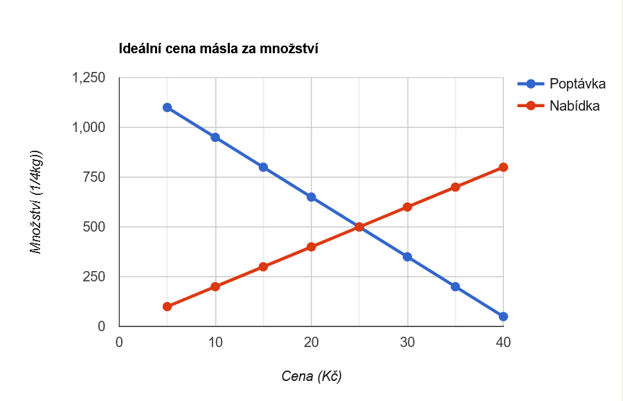

# Základy tržního systému

## Rysy tržní ekonomiky

- Existence trhu
- Konkurence
- Různé vlastnické formy
- Snaha o zisk
- Volné ceny

## Trh

= místo, kde dochází ke směně mezi prodávajícím a kupujícím
= místo, kde se střetává nabídka s poptávkou

## Základní typy trhů

### Trh statků a služeb

- Místo, kde dochází ke směně statků a služeb za peníze

### Trh výrobních faktorů

- Místo, kde dochází ke směně výrobních faktorů za peníze

(Trh peněz = CZK/EUR atd... prostě většina věcí co je na https://tradingview.com, to funguje trochu jinak a zde to zatím neřešíme)

## Domácnosti

- Přicházejí na trh za účelem uspokojení potřeb - potraviny, dovolená, auto
- Chtějí statky a služby pro svoji potřebu
- Vystupují jako kupující na trhu statků a služeb
- Vystupují jako prodávající na trhu výrobních faktorů

## Firmy

- Přicházejí na trh za účelem prodeje statků a služeb s maximálním ziskem
- Vystupují na trhu statků a služeb jako prodávající
  - Může být i nakupující (firma také potřebuje něco pro svoji spotřebu, ale hlavní funkce firmy je na trhu zboží nabízet)
- Vystupují na trhu výrobních faktorů jako kupující

## Stát

- Specifický subjekt trhu
- Má právo trh regulovat a usměrňovat jeho funkci
- Ideálně: podpora pozitivních dopadů trhu; regulace negativních dopadů trhu
- Na obou trzích vystupuje jako prodávající i kupující

## Funkce trhu

- Odpovědět na tři základní otázky:
  - Co vyrábět:
    - To určuje poptávka
  - Jak vyrábět:
    - To určuje nabídka
  - Pro koho vyrábět:
    - Určeno výší příjmu (mzdy, renty, zisky)

## Nabídka a poptávka

- Individuální
- Tržní
- Agragátní

### Poptávka

- **Čím nižší cena, tím vyšší poptávané množství**
- Představuje množství zboží, které jsou kupující ochotni nakoupit při určité ceně

### Nabídka

- **Čím vyšší cena, tím větší nabízené množství**
- Představuje množství zboží nabízeného všemi prodávajícími při určité ceně
  - "Zamýšlený prodej" - kolik toho chce výrobce prodat

## Zákony trhu

1. Zákon nabídky
   - s rostoucí cenou roste i nabízené množství zboží
2. Zákon poptávky
   - S rostoucí cenou klesá poptávané množství zboží

### Křivka poptávky

- křivka má klesající tendenci
- při snižování ceny poptávané množství roste
- faktory ovlivňující poptávky
  - cena
  - demografické změny
  - změny ve výši příjmů obyvatelstva
    . změny v preferencích

### Křivka nabídky

- křivka má stoupající tendenci
- při růstu ceny poroste nabízené množství
- při poklesu ceny bude klesat nabízené množství
- faktory ovlivňující nabídku:
  - cena
  - náklady na výrobu (včetně provozních nákladů)
  - vnější podmínky podnikání

## Situace na trhu I.

- přebytek = poptávané množství je menší než množství nabízené

## Situace na trhu II.

- úbytek = poptávané množství je větší než množství nabízené

## Graf nabídky a poptávky

- posun po křivce - vlivem změny ceny daného statku/služby
- posun celé křivky - vlivem změn všech ostatních proměnných

## Úkol:

- V grafu lze pozorovat, že ideální cena a množství másla je v tomto případě 25Kč na 500 (1/4Kg)

## Vznik rovnovážné ceny

- konkurence na trhu = snaha o získání co největšího počtu kupujících
- kupující mají možnost volby
- cena i nabízené množství se v průběhu času mění
- situace, kdy se vyrovná nabídka a poptávka = **rovnováha na trhu**
- **rovnovážná cena, rovnovážné množství**

## Zisk v tržním systému

- je důvidem existence konkurence na trhu
- stimuluje nabídku
- **výsledek hospodaření** = _výnosy_-_náklady_
